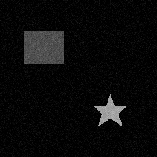
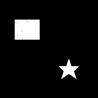

# EC7212: Computer Vision and Image Processing - Assignment 02

## Author

- Name: Thayanan T.
- Registration No: EG/2020/4237
- Date: 27/06/2025

## Overview

This assignment demonstrates basic image processing techniques using Python, OpenCV, and NumPy. The tasks include:

1. **Creating a synthetic image** with two objects (rectangle and star).
2. **Adding Gaussian noise** to the image.
3. **Applying Otsu’s thresholding** for image segmentation.
4. **Implementing and applying a region growing algorithm** for image segmentation.

All code and results are provided in the Jupyter notebook [`EC7212_Assignment2_4237.ipynb`](./EC7212_Assignment2_4237.ipynb).

## Tasks Breakdown

### Task 1: Add Gaussian Noise and Apply Otsu’s Algorithm

- Create a synthetic grayscale image with two objects.
- Add Gaussian noise.
- Apply Otsu’s thresholding for segmentation.

### Task 2: Region Growing Image Segmentation

- Implement a region growing algorithm.
- Use seed points to segment regions in the noisy image.

## Output Samples

All output images are saved in the [`output/`](./output/) directory for reference:

| Image                                                 | Description                      |
| ----------------------------------------------------- | -------------------------------- |
|               | Synthetic image with two objects |
|                     | Image with Gaussian noise        |
|                       | Otsu’s thresholding result       |
|  | Region growing segmentation      |

---
